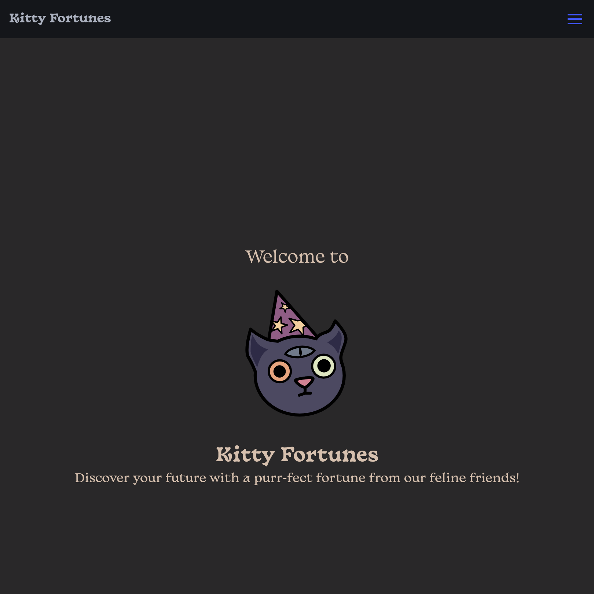
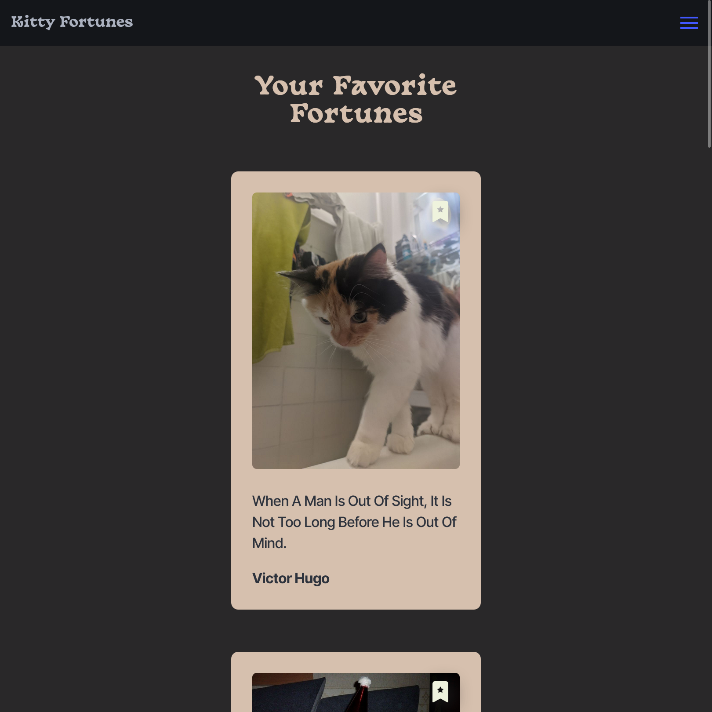

# Kitty Fortunes

[Visit the live site here.](https://geovongriffin.github.io/kitty-fortunes/)

## Description

Welcome to Kitty Fortunes, a lighthearted web app created for the purpose of generating cat-friendly inspiration!

### General Features
- Easy user selection and customization
   - Our short questionnaire will help us tailor your experience
      - What kind of cat do you want?
      - What kind of advice are you looking for?
   - Based on your choices, it will generate a matching quote and cat!
   - You can save it to a favorites list or regenerate for other combos
- There is a random button as well!

### Stretch Goals
- **Edit Favorites List:** Be able to remove and manage your favorites
- **Share Button:** Download or send your fortune cards via link to friends & family

## Technologies Used

### Our Stack
- HTML5
- CSS3
- [Bulma](https://bulma.io/)
- JavaScript

### Core APIs
- [Cat As A Service](https://cataas.com/) by Kevin Balicot
- [Quotable](https://github.com/lukePeavey/quotable) by Luke Peavey

## Contributors
 - Liz 😻 HTML, Page Structure
    - [GitHub](https://github.com/Lizjohnson00)
    - [LinkedIn](https://www.linkedin.com/in/elizabeth-annang-johnson)
 - Natalie 😹 JavaScript, Bulma Integration
    - [Github](https://github.com/futurepraxis)
    - [LinkedIn](https://www.linkedin.com/in/natalie-r-b1310726)
- Geo 🙀 UI, CSS
   - [Github](https://github.com/geovongriffin)
   - [LinkedIn](https://www.linkedin.com/in/geovongriffin)
- Shirleen 😼 (Legacy)
   - [GitHub](https://github.com/bumbleebeed)
   - [LinkedIn](https://www.linkedin.com/in/shirleen-asre-0b9b05b/)